  <h1>🌾 Crop Trading Management System</h1>
  <h3>Multi‑Crop • Farmer‑to‑Trader • Client‑Based • Research & Startup Ready</h3>

  <p>
    
    
    
    
  </p>

  <p><i>A real‑world crop trading solution built for a client, designed with research depth and business scalability.</i></p>
</div>

---

## 🧠 Abstract (Research & Business Perspective)

The **Crop Trading Management System** is a web‑based, multi‑crop trading platform developed for a **real crop trading business client**. The system enables **farmers to sell crops directly to traders**, traders to manage inventory and sales, and administrators to monitor transactions through reports and analytics.

This solution addresses limitations of traditional agricultural trading systems such as manual record‑keeping, lack of transparency, pricing inconsistencies, and inefficient inventory management. The project is suitable for **academic research, final‑year engineering projects, and AgriTech startup prototypes**.

---

## 🎯 Objectives

* To digitize end‑to‑end crop trading operations
* To support **multi‑crop trading** (maize, wheat, rice, cotton, pulses, etc.)
* To allow **direct farmer‑to‑trader crop selling**
* To maintain accurate inventory and transaction records
* To generate analytical reports for business decision‑making
* To reduce manual errors and paperwork

---

## 💼 Business & Startup Relevance

* Acts as a **digital backbone** for crop trading businesses
* Improves transparency between farmers and traders
* Reduces operational losses due to stock mismanagement
* Scalable for regional or national AgriTech platforms
* Can evolve into a B2B agricultural marketplace

---

## 🧩 Core Features

### 👨‍🌾 Farmer → Trader Crop Selling

* Farmers can sell crops directly to traders
* Crop details include type, quantity, quality, and price
* Stock is updated automatically after purchase

### 🌾 Multi‑Crop Trading Support

* Supports all types of crops (not limited to maize)
* Crop‑wise inventory and pricing management

### 📦 Inventory & Stock Management

* Real‑time stock updates
* Crop‑wise quantity tracking
* Low‑stock alerts (optional)

### 🧾 Billing & Transactions

* Purchase and sales entry management
* Automated invoice / bill generation
* Accurate financial records

### 📊 Reports & Analytics

* Daily and monthly transaction reports
* Crop‑wise stock and sales analysis
* Business performance insights

### 🔐 Security & Access Control

* Admin authentication
* Secure data storage

---

## 🖼️ Application Screenshots

 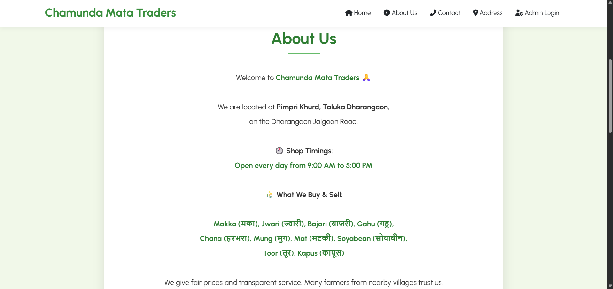 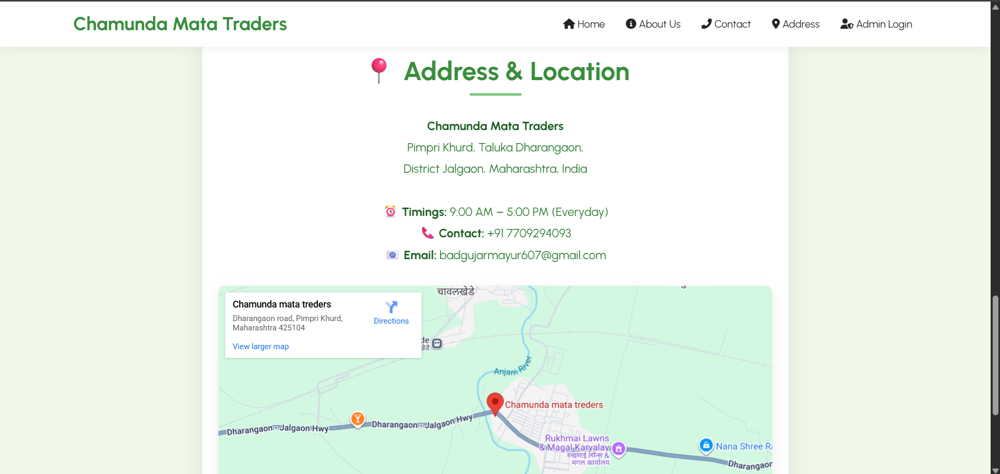 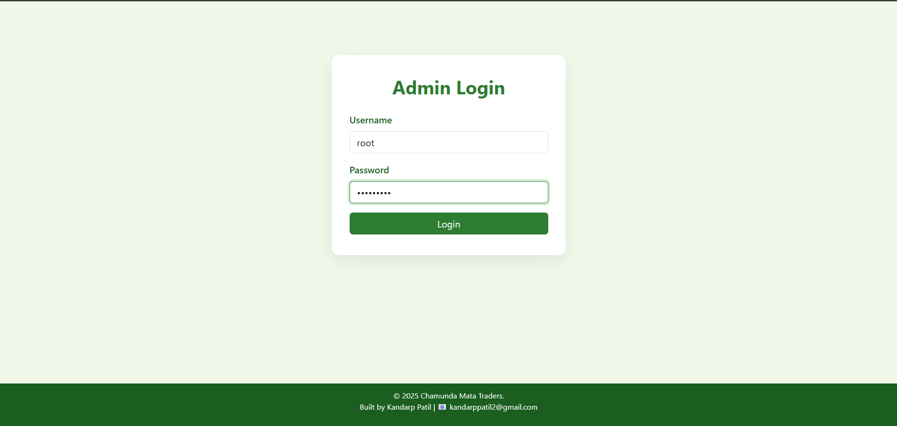 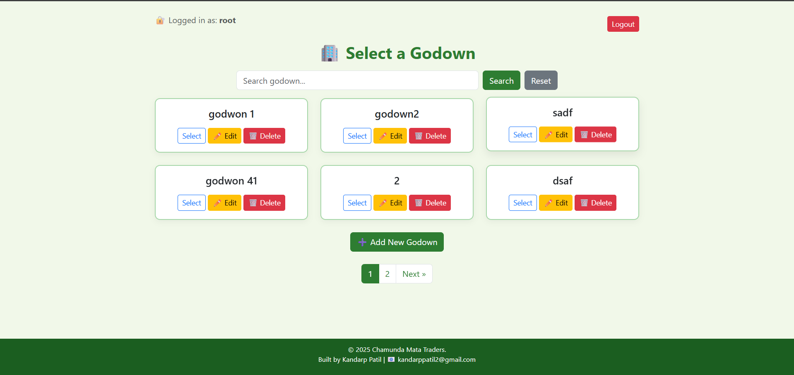 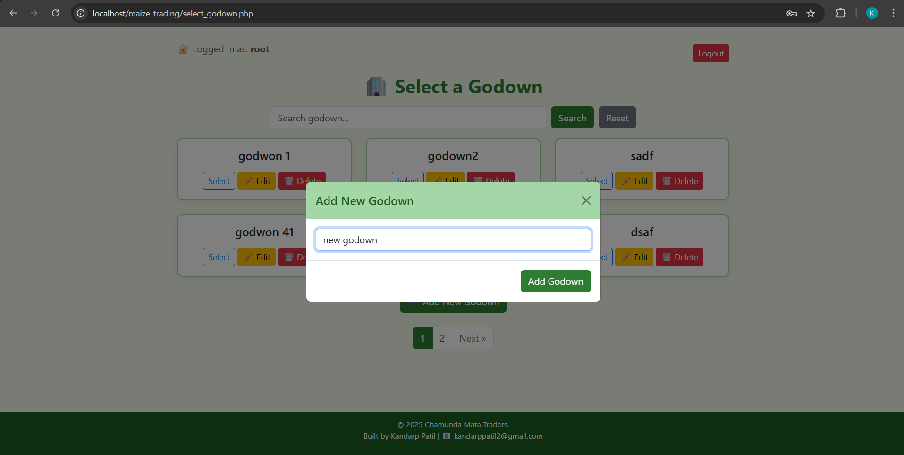 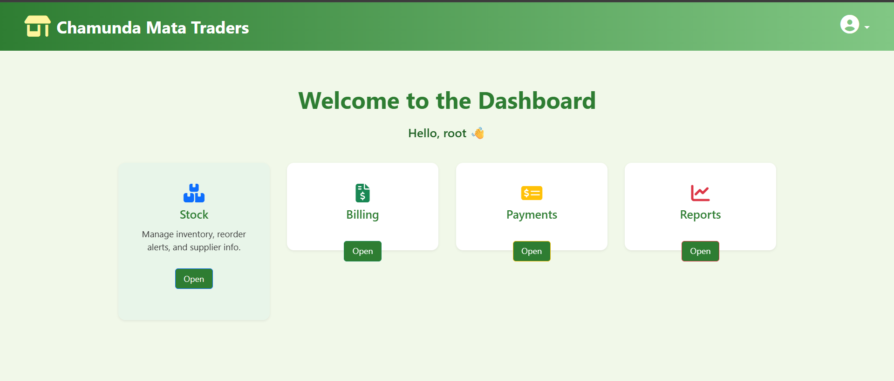 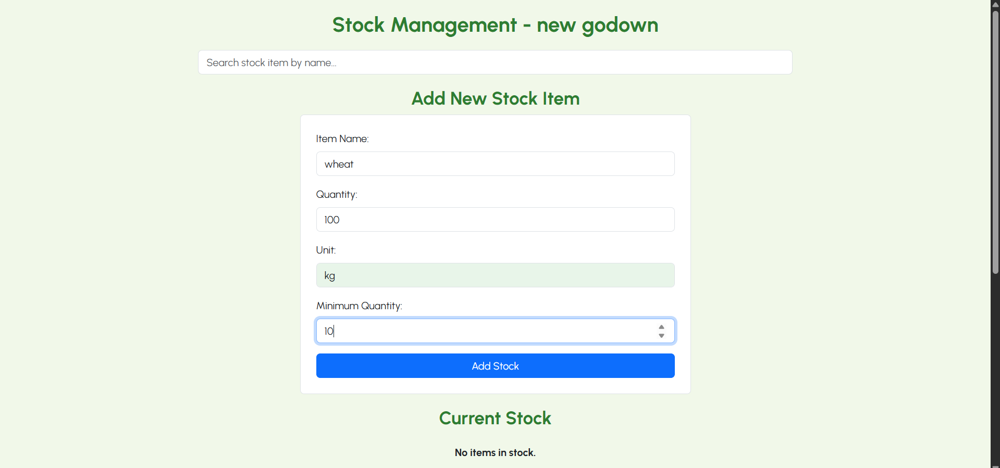 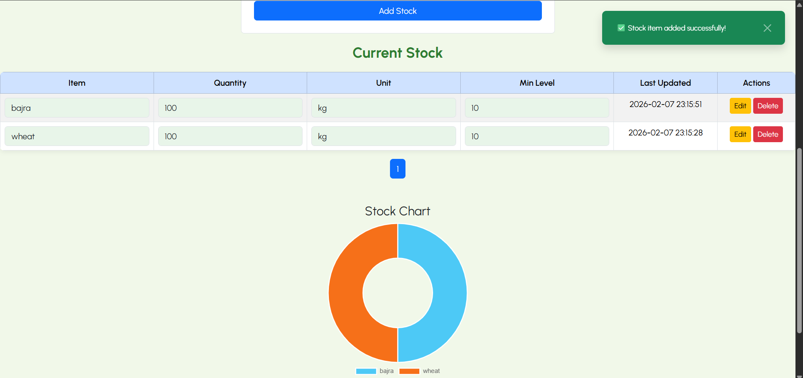 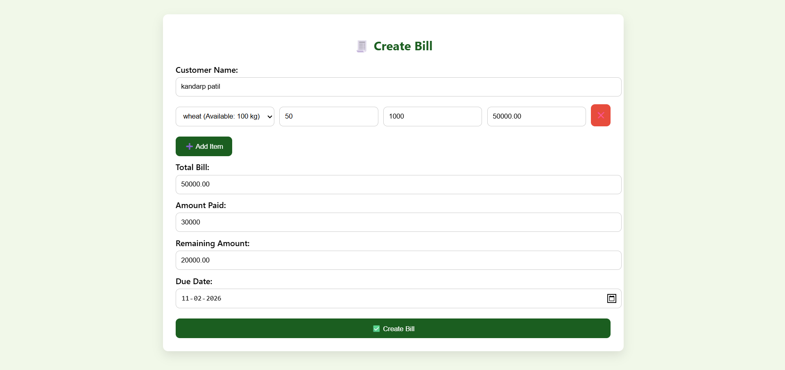 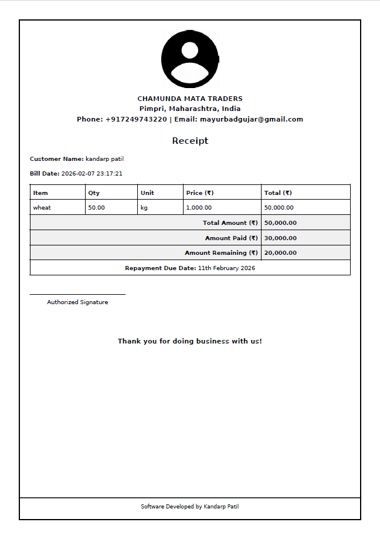 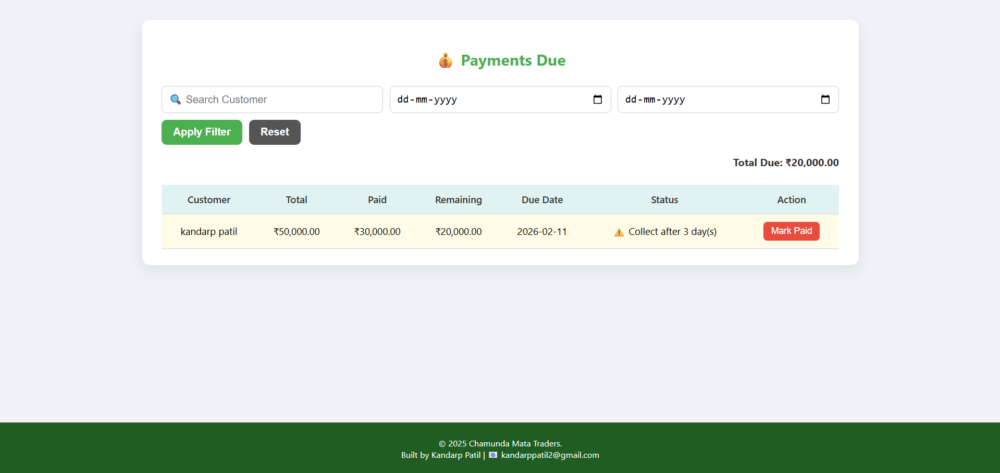 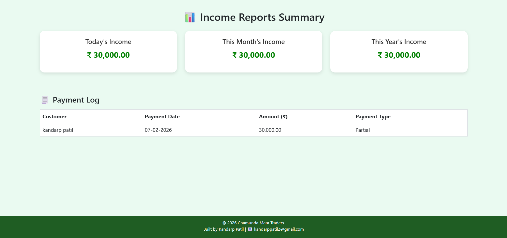

---


## 🛠️ Technology Stack

| Layer    | Technology                          |
| -------- | ----------------------------------- |
| Frontend | HTML, CSS, JavaScript               |
| Backend  | PHP                                 |
| Database | MySQL                               |
| Tools    | XAMPP / WAMP, VS Code, Git & GitHub |

---

## ⚙️ Installation & Setup

1. Clone the repository:

   ```bash
   git clone https://github.com/your-username/crop-trading-management-system.git
   ```

2. Move the project to `htdocs` (XAMPP) or `www` (WAMP)

3. Create a database named `crop_trading`

4. Import the SQL file into phpMyAdmin

5. Configure database credentials in PHP config file

6. Start Apache and MySQL

7. Open in browser:

   ```
   http://localhost/crop-trading-management-system
   ```

---

## 📈 Future Scope

* Role‑based login (Farmer / Trader / Admin)
* Online payment & settlement module
* AI‑based crop price prediction
* Blockchain for transparent trade records
* Mobile application for farmers
* SMS / WhatsApp notifications

---

## 📜 Academic & Research Relevance

* Demonstrates practical application of **DBMS concepts**
* Suitable for **final‑year engineering projects**
* Can be extended for research in AgriTech, AI, and Blockchain
* Real‑world client‑based problem solving

---

## 👤 Client & Developer

**Developed for:** Real Crop Trading Business Client

**Developer:** Kandarp Patil

BTech – Computer Engineering

Government College of Engineering, Jalgaon

---

<div align="center">
  ⭐ <b>If you like this project, don’t forget to star the repository!</b>
</div>
